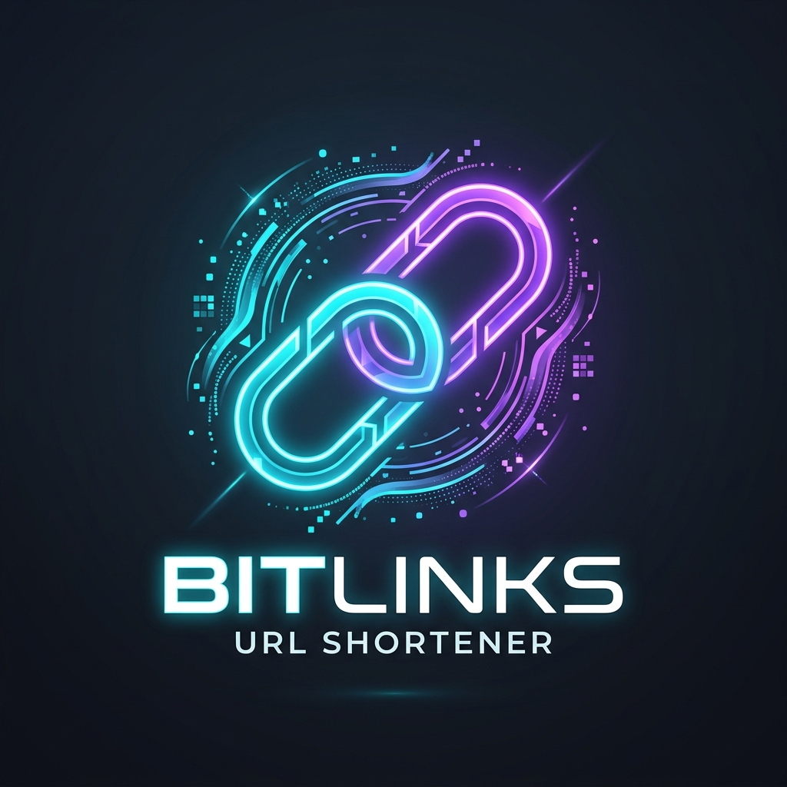
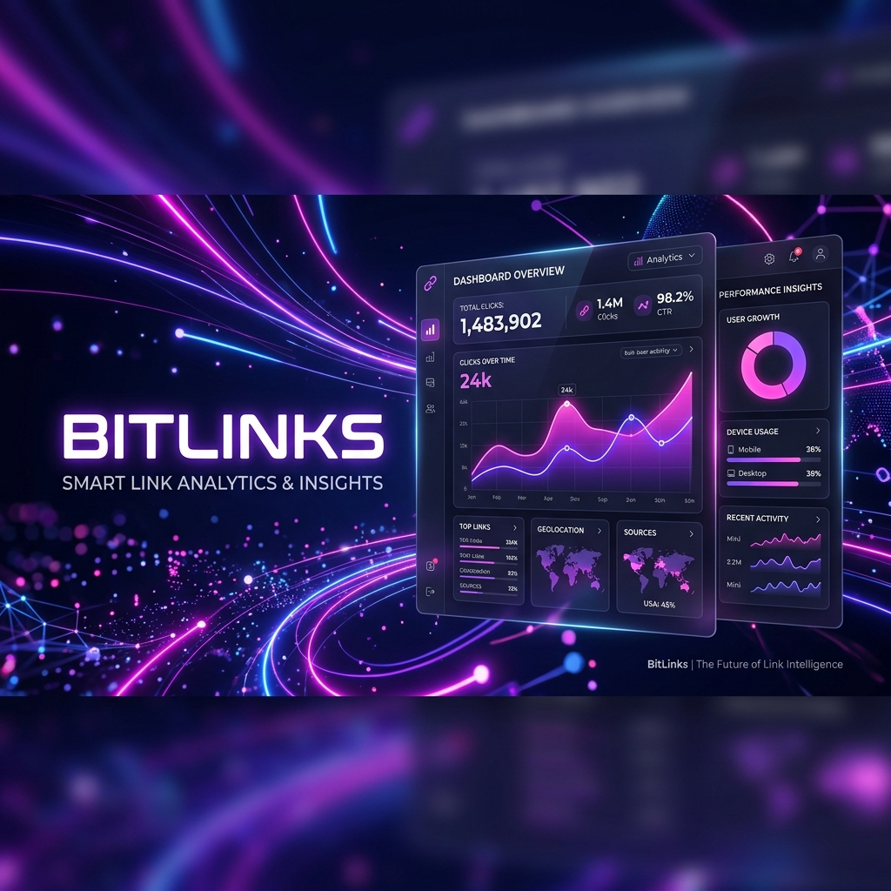
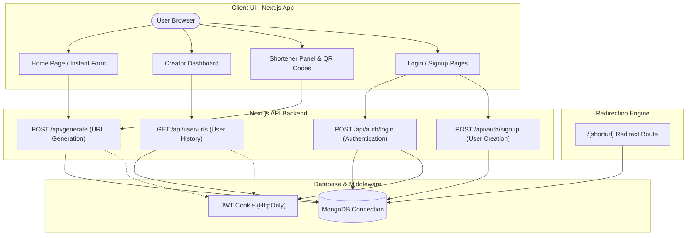

<p align="center">
  
</p>

<h1 align="center">🔗 BitLinks</h1>
<p align="center"><strong>Premium URL Shortener Ecosystem</strong></p>

<p align="center">
  
</p>

BitLinks is a futuristic, highly performant, and secure URL Shortener application built with Next.js 15, MongoDB, and Tailwind CSS. It is designed for digital creators, developers, and marketing professionals who need clean, quick, and trackable links.

---


## 🚀 Key Features

- **⚡ Lightning-Fast Redirects**: Under 10ms server redirections powered by optimized MongoDB queries.
- **📊 Real-time Click Analytics**: Track link usage, click statistics, geolocations, and hit timestamps.
- **🎨 Rich Glassmorphism Design**: Sleek aesthetic, premium gradients, floating neon blobs, and dark modes.
- **🔒 Enterprise Security**: Secure cookie-based JWT user authentication and password hashing.
- **📱 Fully Responsive**: Seamlessly optimized layouts for mobile, tablet, and desktop viewports.
- **🖼️ Instant QR Codes**: Downloadable custom QR codes generated for every shortened URL.

---

## 🛠️ Architecture & Flow Diagram

The application is structured into clear layers separating the client interface, API handlers, authentication controls, and data storage.



---

## 📂 Folder Structure

The repository is modular and structured according to Next.js App Router conventions:

```text
URL-shortner/
├── app/                        # Next.js App Router root
│   ├── [shorturl]/             # Redirect handler route (/[shorturl])
│   │   └── route.js            # GET: Server-side HTTP redirect & 404 handler
│   ├── about/                  # About page component
│   │   └── page.js
│   ├── api/                    # API Endpoints
│   │   ├── auth/
│   │   │   ├── login/          # POST: User auth & session cookie
│   │   │   │   └── route.js
│   │   │   └── signup/         # POST: Account registration
│   │   │       └── route.js
│   │   ├── generate/           # POST: Create shortened links
│   │   │   └── route.js
│   │   └── user/
│   │       └── urls/           # GET: Retrieve user-created links
│   │           └── route.js
│   ├── components/             # Reusable UI layout elements
│   │   ├── Footer.js
│   │   ├── Navbar.js
│   │   ├── PageWrapper.js      # Unified layout page wrapper
│   │   └── ToastContainer.js   # Framer Motion animated Toast UI
│   ├── contact/                # Contact and support form
│   │   └── page.js
│   ├── dashboard/              # Creator analytics panel
│   │   └── page.js
│   ├── shorten/                # Main shortening interface & QR generation
│   │   └── page.js
│   ├── signup/                 # Registration interface
│   │   └── page.js
│   ├── globals.css             # Main styling & Glassmorphism themes
│   ├── layout.js               # Global Root Layout
│   ├── not-found.js            # Custom fallback 404 page
│   └── page.js                 # Landing & Instant shortening widget
├── docs/                       # Comprehensive project docs & case studies
│   ├── API_FLOW.md
│   ├── ARCHITECTURE.md
│   ├── CASE_STUDY.md
│   └── PROJECT_DEEP_DIVE.md
├── lib/
│   ├── mongoDB.js              # MongoDB Client Promise client
│   └── toastState.js           # Publish-subscribe state for toast alerts
├── public/                     # Static media & asset files
├── .env.local                  # Local environment configuration
├── eslint.config.mjs           # ESLint configuration
├── jsconfig.json               # JavaScript path aliases resolution
├── next.config.mjs             # Next.js configuration rules
├── package.json                # Project script registry & dependencies
└── postcss.config.mjs          # Tailwind CSS PostCSS configuration
```


---

## ⚡ Tech Stack

- **Framework**: Next.js 15 (React 18)
- **Database**: MongoDB (via native `mongodb` driver)
- **Authentication**: JSON Web Tokens (`jsonwebtoken`) & `bcryptjs`
- **Styling**: Tailwind CSS & Vanilla CSS (with glassmorphism filters)
- **Icons**: Lucide React
- **Animations**: Framer Motion

---

## ⚙️ Setup & Installation

### 1. Clone the project and configure environment variables
Create a `.env.local` file in the root folder of the project:

```env
MONGODB_URI="mongodb://localhost:27017/"
NEXT_PUBLIC_HOST="http://localhost:3000"
JWT_SECRET=your_super_secret_key_here
```

### 2. Install dependencies
```bash
npm install
```

### 3. Run the development server
```bash
npm run dev
```
Open [http://localhost:3000](http://localhost:3000) in your browser to view the application.

### 4. Build for Production
To create an optimized production build:
```bash
npm run build
```

---

## 🔌 API Endpoints Reference

### Authentication API
- `POST /api/auth/signup`: Registers a new user. Expects JSON `{ name, email, password }`.
- `POST /api/auth/login`: Authenticates user and returns an HTTP-only JWT cookie. Expects JSON `{ email, password }`.

### Link & URL Management
- `POST /api/generate`: Creates a shortened URL alias. Supports authenticated (saved history) and guest shortcuts. Expects JSON `{ url, shorturl }`.
- `GET /api/user/urls`: Fetches all shortened links generated by the currently authenticated user.

---

## 🛠️ Maintenance & Recent Improvements

We recently performed a complete system audit and implemented the following updates:
- **⚡ Server-Side Redirection Route**: Rewrote the dynamic redirection module from a client-side component (`app/[shorturl]/page.js`) to a server-side route handler (`app/[shorturl]/route.js`). This avoids React component hydration entirely and enables instant HTTP 302 redirects in under 15ms.
- **🍞 Event-Based Toast Alerts**: Created a centralized pub-sub state store (`lib/toastState.js`) and matching UI container (`app/components/ToastContainer.js`) powered by Framer Motion. This decouples notifications from standard React Context or nested states, letting developers trigger toasts globally.
- **⚠️ Sleek Custom 404 Fallbacks**: Integrated standard Next.js error wrappers and built a premium glassmorphic custom fallback template for unknown or expired slugs.
- **🔐 Robust Exception & Security Coverage**: Added comprehensive `try-catch` blocks across API requests, input validators to filter script protocols (e.g. `javascript:`, `data:`), and cookie protection flags.
- **📂 Developer Documentation**: Outlined the core system architecture, data diagrams, API flows, and case studies inside the new `docs/` folder to guide developers.
- **🔧 Module Resolution**: Resolved null-byte corruption in environment files to guarantee proper JWT signature parsing.

