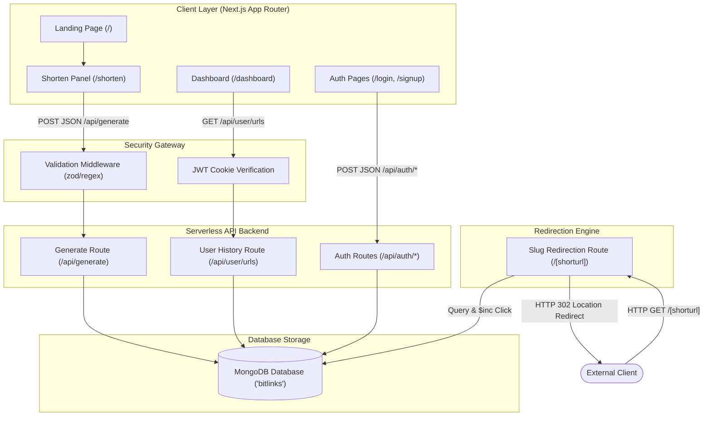

# BitLinks 🔗 System Architecture & Design Specification

This document provides an architectural analysis of the **BitLinks** premium URL shortener ecosystem. It covers the system flow, component design patterns, database modeling, and security framework.

---

## 🏗️ 1. Architectural Overview

BitLinks is built on the **Next.js 15 App Router** architecture, leveraging a unified full-stack model. The frontend React client communicates with Next.js serverless API routes to generate and display links, while server-side redirection is resolved instantly at the edge/server level using standard Next.js route handlers.

---

## 🗃️ 2. Database Schema & Storage Design

BitLinks implements a relational-like model within a flexible BSON structure in **MongoDB**. The database contains two core collections: `users` and `url`.

### A. Users Collection (`users`)
Stores user profiles and hashed credentials.
* **Fields:**
  - `_id`: `ObjectId` (Primary Key)
  - `name`: `String` (User's display name)
  - `email`: `String` (Unique identifier, lowercased, validated)
  - `password`: `String` (Salted Blowfish encryption via `bcryptjs` with cost factor 10)
  - `createdAt`: `Date` (Account creation timestamp)

### B. URLs Collection (`url`)
Stores mapped URL associations and analytics data.
* **Fields:**
  - `_id`: `ObjectId` (Primary Key)
  - `url`: `String` (Original long destination URL)
  - `shorturl`: `String` (Unique short alias used as slug; Indexed)
  - `userId`: `ObjectId` (Nullable; Foreign Key linking to `users._id` for registered users)
  - `clicks`: `Number` (Counter tracking total redirects)
  - `createdAt`: `Date` (Link generation timestamp)

---

## 🔒 3. Security Boundary & Controls

To ensure high-grade data isolation and protect against malicious vectors, BitLinks incorporates a multi-layer security gateway:

### A. HttpOnly Session Cookies
JWT sessions are signed backend-side with a high-entropy secret (`JWT_SECRET`) using `HS256`. 
* The token cookie is generated and transmitted using the following header attributes:
  - `HttpOnly`: Prevents client-side scripts (e.g., cross-site scripting/XSS attacks) from reading the token.
  - `SameSite=Strict`: Shields the API from Cross-Site Request Forgery (CSRF) attempts.
  - `Secure` (in production): Forces the cookie to be transmitted solely over encrypted HTTPS connections.

### B. Production Security Headers
Standard security headers are injected in [next.config.mjs](file:///c:/Users/91836/Downloads/Mern-Ai-Projects/URL-shortner/next.config.mjs) for all request routes:
- `X-Frame-Options: DENY` (prevents Clickjacking)
- `X-Content-Type-Options: nosniff` (forces correct MIME types and blocks sniffing)
- `Referrer-Policy: strict-origin-when-cross-origin` (controls referral details)
- `Strict-Transport-Security` (enforces cryptographic SSL/TLS routing over HTTPS)

### C. Input Sanitization & Verification
1. **URL Scheme Restrictions**: The system rejects invalid protocols, allowing only `http:` and `https:` to protect against dangerous URI schemas like `javascript:` or `data:`.
2. **Short URL Sanitization**: Custom slugs are parsed against a strict regular expression `/^[a-zA-Z0-9_-]+$/` and have a **30-character maximum length limit**. This blocks payload injection and prevents UI/database bloating.

---

## ⚙️ 4. Performance & Redirection Optimization

1. **Resilient MongoDB Connection Caching**: The application utilizes a cached client promise inside [mongoDB.js](file:///c:/Users/91836/Downloads/Mern-Ai-Projects/URL-shortner/lib/mongoDB.js). If the database encounters a temporary outage, the cache resets on promise rejection to prevent permanent server failure states.
2. **Database Operation Retries**: Crucial database transactions are wrapped in `executeDbWithRetry(operation, maxRetries, delayMs)` which performs linear-backoff retries for transient connection drops.
3. **Early Slug Guard**: The redirection handler validates the dynamic `shorturl` path parameter format via regex before querying the database, instantly short-circuiting invalid paths with a 404 HTML response without database lookup overhead.
4. **Click Analytics Buffering**: Redirect responses do not block on database writes. The redirection engine returns the HTTP 302 redirect location header immediately, while database updates (`$inc` clicks) are performed asynchronously in the background using Next.js 15's stable `after` API.

